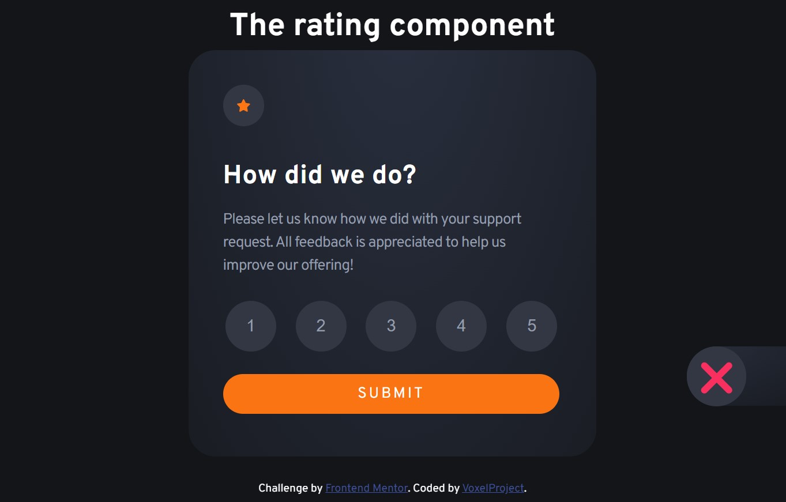
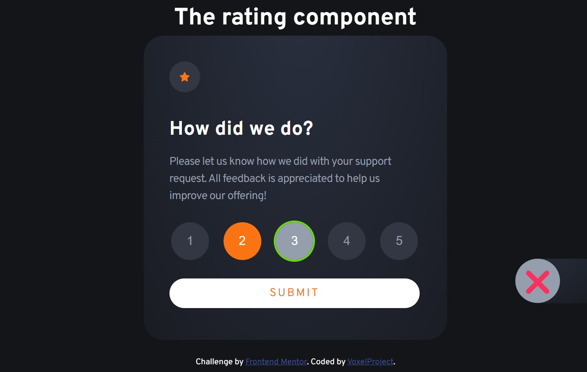
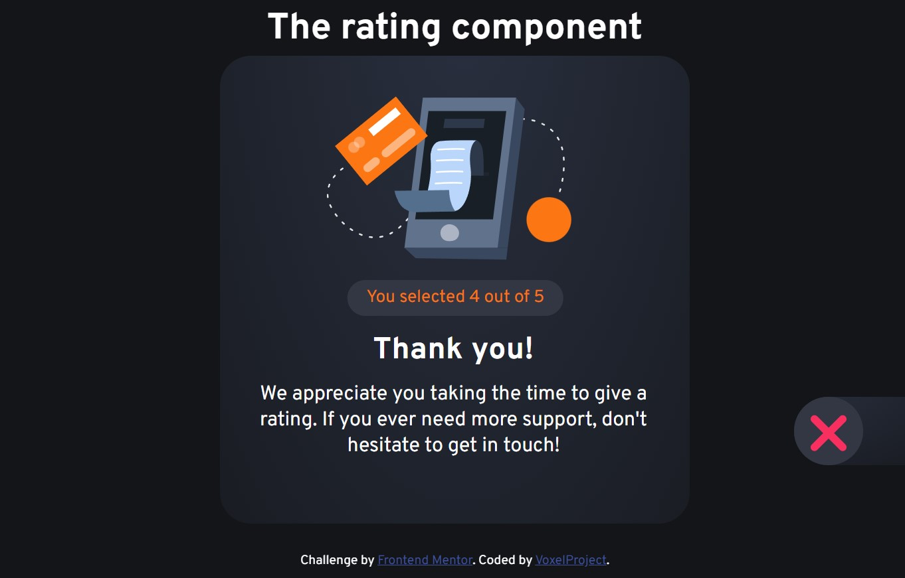
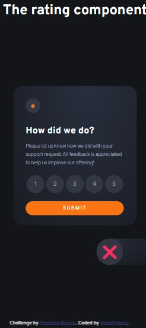
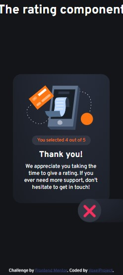

# Frontend Mentor - Interactive rating component solution

This is a solution to the [Interactive rating component challenge on Frontend Mentor](https://www.frontendmentor.io/challenges/interactive-rating-component-koxpeBUmI). Frontend Mentor challenges help you improve your coding skills by building realistic projects. It very good and recomendable base for starting creating projects.

## Table of contents

- [Overview](#overview)
  - [The challenge](#the-challenge)
  - [Screenshot](#screenshot)
  - [Links](#links)
- [My process](#my-process)
  - [Built with](#built-with)
  - [What I learned](#what-i-learned)
  - [Continued development](#continued-development)
  - [Useful resources](#useful-resources)
- [Author](#author)
- [Acknowledgments](#acknowledgments)

## Overview

### The challenge

Users be able to:

- View the optimal layout for the app depending on their device's screen size
- See hover states for all interactive elements on the page
- Select and submit a number rating
- See the "Thank you" card state after submitting a rating
- Reset page localStoradge

### Screenshot

| **Design**                                | **Mine solution**                       |
| ----------------------------------------- | --------------------------------------- |
|           |         |
|            |        |
|  |        |
|            |   |
|   |  |

### Links

- Solution URL: [Code](https://github.com/VoxelProject/WebCoding/tree/main/html/projekty/interactive-rating-component-main)
- Live Site URL: [Page](https://voxelproject.github.io/WebCoding/html/projekty/interactive-rating-component-main/)

## My process

### Built with

- Semantic HTML5 markup
- CSS custom properties
- Flexbox
- VanillaJS
- JavaScript `classList`
- JavaScript `localStoradge`

### What I learned

<!-- Use this section to recap over some of your major learnings while working through this project. Writing these out and providing code samples of areas you want to highlight is a great way to reinforce your own knowledge.

To see how you can add code snippets, see below:

```html
<h1>Some HTML code I'm proud of</h1>
```

```css
.proud-of-this-css {
  color: papayawhip;
}
```

```js
const proudOfThisFunc = () => {
  console.log("🎉");
};
```

If you want more help with writing markdown, we'd recommend checking out [The Markdown Guide](https://www.markdownguide.org/) to learn more.

**Note: Delete this note and the content within this section and replace with your own learnings.** -->

### Continued development

<!-- Use this section to outline areas that you want to continue focusing on in future projects. These could be concepts you're still not completely comfortable with or techniques you found useful that you want to refine and perfect.

**Note: Delete this note and the content within this section and replace with your own plans for continued development.** -->

### Useful resources

- [YouTube Tutorials](https://www.youtube.com/c/Jakzacząćprogramować) - How to use VanillaJS `classList` and `localStorage`. I really liked this pattern and will use it going forward.
- [List and using tags and atributes](https://www.w3schools.com/html) - Types and using HTML tags and atributes
- [What's the Difference? var let const](https://www.freecodecamp.org/news/var-let-and-const-whats-the-difference/)
- [How to draw X? - forum answer](https://stackoverflow.com/questions/18920542/draw-an-x-in-css#answer-18921065) - This helped me draw x to reseting localstoradge
- [`.md` TABLE GENERATOR](https://www.tablesgenerator.com/markdown_tables) - Peaceful tool to creating tables in `.md` files

## Author

- Website - [VoxelProject](https://github.com/VoxelProject)
- Frontend Mentor - [@VoxelProject](https://www.frontendmentor.io/profile/VoxelProject)

## Acknowledgments

Thank you user [**Gildas.Tambo**](https://stackoverflow.com/users/2065597/gildas-tambo) for [answer](https://stackoverflow.com/questions/18920542/draw-an-x-in-css#answer-18921065)<br/>
and [How to get programming hannel](https://www.youtube.com/c/Jakzacząćprogramować)
